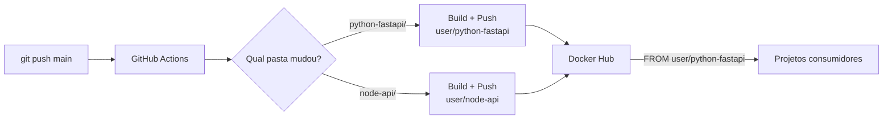

# 🐳 Docker Base Images

Repositório centralizado de imagens base Docker otimizadas, com pipeline CI/CD para build e push automático no Docker Hub.

Quando um Dockerfile é alterado, o GitHub Actions detecta qual imagem mudou e faz push apenas dela.



## 📦 Imagens disponíveis

| Imagem | Status | Docker Hub |
|--------|--------|------------|
| [python-fastapi](./python-fastapi/) | ✅ Disponível | `vivikk/imagem-base-otimizada` |
| [node-api](./node-api/) | 🚧 Em breve | — |

## 📊 Comparativo: Naive vs Otimizado

Build real da imagem `python-fastapi`:

| | Naive (`Dockerfile.naive`) | Otimizado (`Dockerfile`) |
|---|---|---|
| **Tamanho** | 1.17 GB | 158 MB |
| **Redução** | — | **~86%** |
| **Imagem base** | `python:3.12` (full) | `python:3.12-slim` |
| **Multi-stage** | ❌ | ✅ |
| **Non-root user** | ❌ (root) | ✅ (appuser) |
| **Health check** | ❌ | ✅ |
| **Layer caching** | ❌ | ✅ (`--prefix=/install`) |
| **.dockerignore** | ❌ | ✅ |

## 🔧 Técnicas de otimização aplicadas

### 1. Multi-stage build
Separa o stage de instalação de dependências do runtime. O stage final recebe apenas os pacotes instalados, sem cache do pip, headers de compilação ou ferramentas de build.

### 2. Imagem slim
`python:3.12-slim` (~50MB) vs `python:3.12` (~350MB). A versão slim remove compiladores, man pages e pacotes desnecessários para runtime.

### 3. `pip install --prefix`
Instala dependências em diretório isolado (`/install`). No stage final, copia apenas `/install/lib` e `/install/bin` — sem lixo do sistema.

### 4. Non-root user
Container roda como `appuser` em vez de `root`. Reduz superfície de ataque caso o container seja comprometido.

### 5. HEALTHCHECK
Docker monitora a saúde do container nativamente. Orquestradores como ECS e Docker Swarm usam isso para restart automático.

### 6. Layer caching
`requirements.txt` é copiado e instalado antes do código da aplicação. Mudanças no código não invalidam o cache das dependências.

### 7. .dockerignore
Exclui `.git/`, `__pycache__/`, `*.md`, `Dockerfile*` do build context. Reduz tempo de build e evita vazamento de arquivos sensíveis.

### 8. Variáveis de ambiente Python
- `PYTHONDONTWRITEBYTECODE=1` — não gera `.pyc` (desnecessário em container)
- `PYTHONUNBUFFERED=1` — logs aparecem em tempo real no `docker logs`

## 🚀 Como usar

### Nos seus projetos

```dockerfile
FROM vivikk/imagem-base-otimizada:latest

WORKDIR /app
COPY . .

# Instale dependências extras da sua app (se houver)
RUN pip install --no-cache-dir -r requirements.txt

CMD ["uvicorn", "app.main:app", "--host", "0.0.0.0", "--port", "8000"]
```

Veja o [fastapi-example-app](./examples/fastapi-app/) como exemplo completo.

### Build local

```bash
cd python-fastapi/
docker build -t python-fastapi .
```

## ⚙️ CI/CD

O pipeline usa [GitHub Actions](./.github/workflows/build-push.yml) com:

- **dorny/paths-filter** — detecta qual pasta foi alterada
- **docker/build-push-action** — build com BuildKit + cache
- **GHA cache** — cache de layers entre builds

### Secrets necessários no GitHub

| Secret | Descrição |
|--------|-----------|
| `DOCKERHUB_USERNAME` | Seu usuário do Docker Hub |
| `DOCKERHUB_TOKEN` | Access Token do Docker Hub |

## 📁 Estrutura

```
docker-optimized-images/
├── python-fastapi/
│   ├── Dockerfile            # ✅ otimizado
│   ├── Dockerfile.naive      # ❌ baseline para comparação
│   ├── .dockerignore
│   ├── requirements.txt
│   └── README.md
├── node-api/
│   └── README.md             # 🚧 placeholder
├── examples/
│   └── fastapi-app/          # app de exemplo consumindo a imagem base
│       ├── app/main.py
│       ├── Dockerfile
│       ├── docker-compose.yml
│       └── README.md
├── .github/
│   └── workflows/
│       └── build-push.yml
└── README.md                 # ← você está aqui
```
